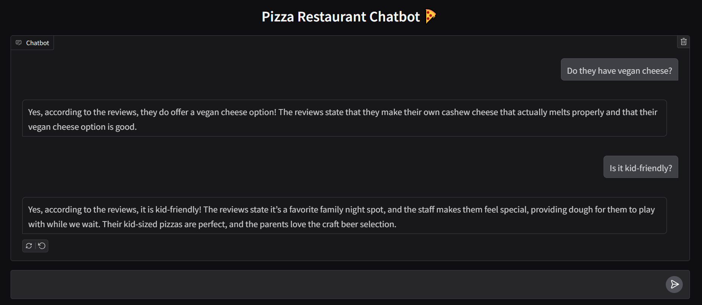
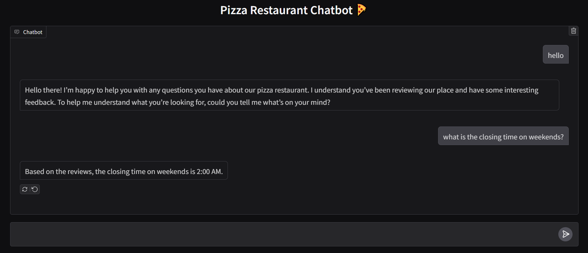

# 🍕 Pizza Restaurant RAG Chatbot

A conversational AI chatbot that answers questions about a pizza restaurant using realistic customer reviews.

Built with [Ollama](https://ollama.com/), [LangChain](https://www.langchain.com/), [ChromaDB](https://www.trychroma.com/), and [Gradio](https://www.gradio.app/).

---

## 🚀 Features

- **Retrieval-Augmented Generation (RAG):** Answers are grounded in actual restaurant reviews.
- **Runs Locally:** Uses open-source models via Ollama on your own machine.
- **Simple Web UI:** Powered by Gradio for easy interaction.

---

## 🧠 Models Used

- **LLM:** [`gemma3:1b`](https://ollama.com/library/gemma3)
- **Embeddings:** [`mxbai-embed-large`](https://ollama.com/library/mxbai-embed-large)

---

## 📝 Example Questions

- "Do they have vegan cheese?"
- "How is the crust?"
- "Is it kid-friendly?"
- "What are the best menu items?"

---

## 📸 Screenshots

*Figure: The Gradio web interface of the Pizza Restaurant RAG Chatbot*

*Figure: The Gradio web interface of the Pizza Restaurant RAG Chatbot*

